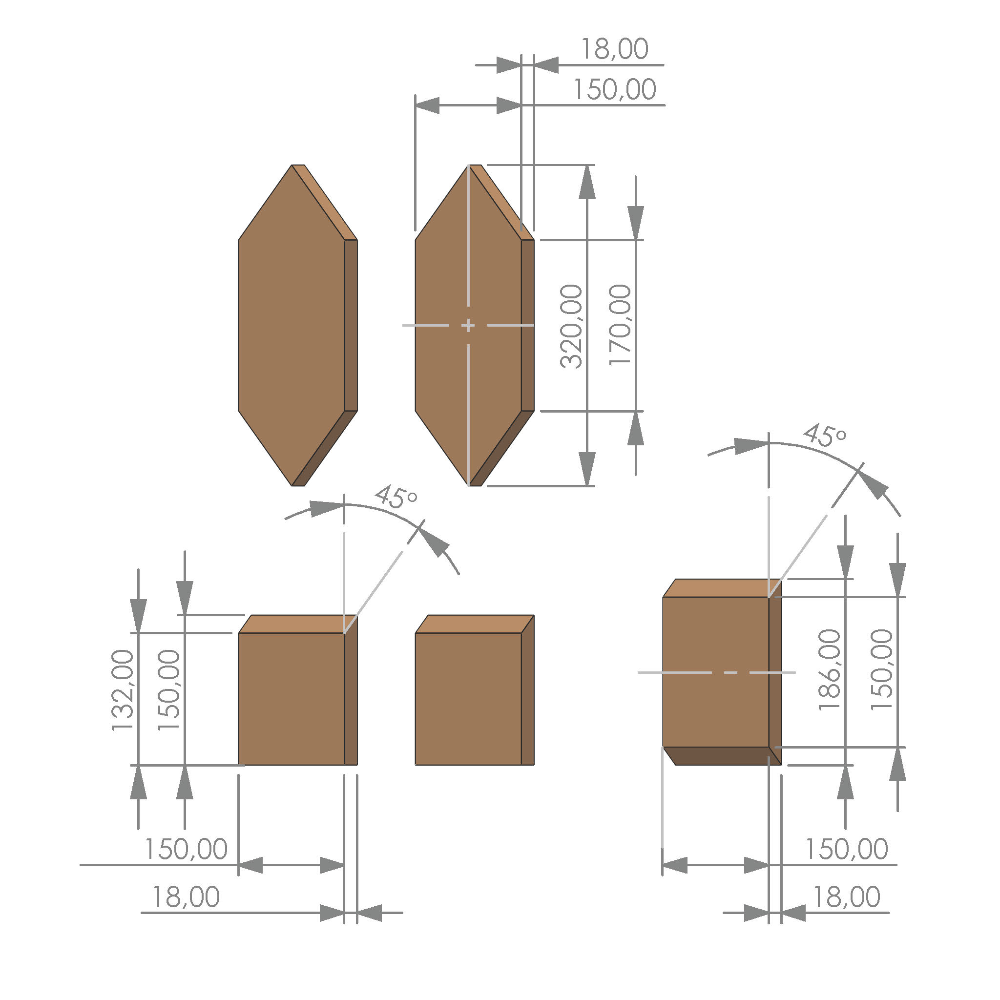
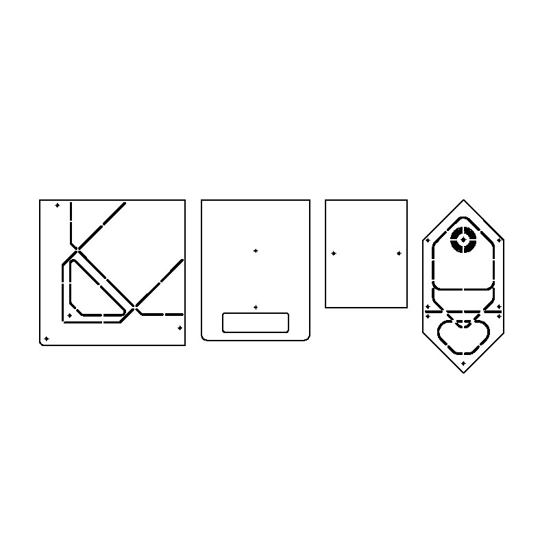

# Anleitung zur Fertigung der einzelnen Bauteile

Hier und im folgenden ist beschrieben wie beim Bau von Vogelhaus "Blumenkasten" idealerweise vorgegangen werden kann. Ergänzende Infos und Kaufvorschläge der Materialien sind unter "Drawings", "Materiallsite_Vogelhaus_Blumenkasten" zu finden. 

__Schritt 1__ Fertigung der Holzteile

Die Holzteile können aus einem einzelnen Werkstoffteil (1200/150/18mm) oder mehreren Brettern gefertigt werden. Entscheidend ist die Materialstärke von 18 mm (+-0.5 mm). Da auch schräge Schnitte notwendig sind sollten diese Komponenten mit einer Tischkreissäge, Tauchsäge oder Formatkreissäge umgesetzt werden.  

__Schritt 2__ Fertigung der Kunststoffteile 

Um die Rohlinge der Kunststoffteile zuzuschneiden wird eine Platte der Größe 1000/550/7 mm oder mehrere einzelne benötigt. 
Entscheidend ist auch hier die Materialstärke von 7 mm (+- 0.5 mm) Da besonders hier sehr maßgenau gearbeitet werden muss, ist eine Nachbearbeitung der Teile nicht ausgeschlossen. Idealerweise sollten diese Komponenten mit einer Tischkreissäge, Tauchsäge oder Formatkreissäge umgesetzt werden.   

__Schritt 3__ Fertigung der 3D Druck Teile 

Im Ordner 3D_Printing ist eine Datei mit dem Namen "STL_3D_Druck_Kompnenten" zu finden. Um alle 3D Druck Profile wie dort in einem Rutsch zu drucken muss der Drucker ein Druckbett mit einer eine Fläche von mindestens 200/250 mm aufweisen und auf 200 mm Höhe drucken können. Die einzelnen Komponenten können natürlich auch einzeln gedruckt werden. Das verwendete Material sollte wetterbeständig, formstabil und idealerweise möglichst nachhaltig sein. Die Anordnung Ausrichtung der Teile für ein ideales Ergebnis ohne Stützmaterial und entsprechend überflüssige Nachbarbeitung sieht wie folgt aus: 

Du findest die entsprechende 3D-Druck Datei [hier](../3D_printing/STL_3D_Druck_Komponenten.STL)

__Schritt 4__ Fertigung der Varianten- Schablone 

Im Ordner "Drawings" findet ihr neben den Bemaßungen auch eine SVG Datei namens "Laser_Schablonen.svg" Ihr könnt die Datei nutzen um Schablonen herzustellen, die es euch möglich machen die Konturen der 5 Varianten (V1-V5) mit einem spitzen Bleistift durch die ausgelaserten Linien nachzuzeichnen. Habt ihr die Schablone also einmal gefertigt, lässt sich jede der Varianten deutlich einfacher umsetzen, als jede Linie einzeln anzuzeichnen. Diese sieht in etwa so aus:   

Alle Schablonen lassen sich gemeinsam aus einer Platte der Größe 800/320 mm ausschneiden. 
Das ideale Material ist MDF oder HDF mit einer Dicke von 3-5 mm. Auch Leimholzplatten sind denkbar, jedoch etwas weniger stabil. Einige Kuststoffsorten kommen ebenfalls in Frage.  Grundsätzlich gilt es aber ein Material zu wählen, dass überhaupt mit Industrielasern bearbeitet werden kann. Nicht geeignet, weil leicht entflammbar und gesundheitsschädlich sind bspw. PVC u. PVB. Es ist wichtig sich vor der Materialwahl und Umsetzung genauer über die entsprechenden Sicherheitsvorschriften zu informieren. 

Du findest die Schablonensammlung [hier](../Drawings/Laser_Schablonen.svg) 

